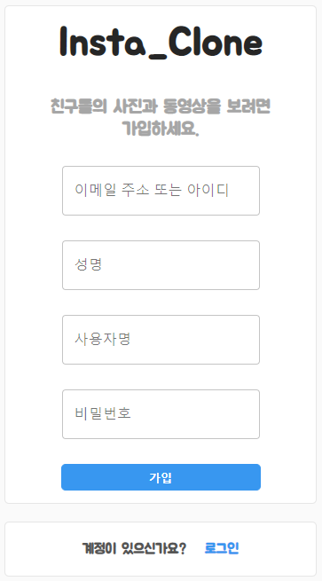
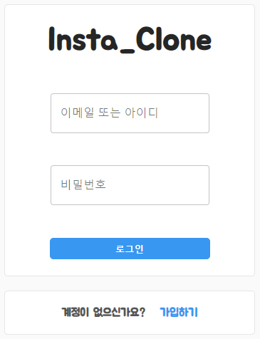
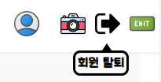
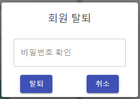
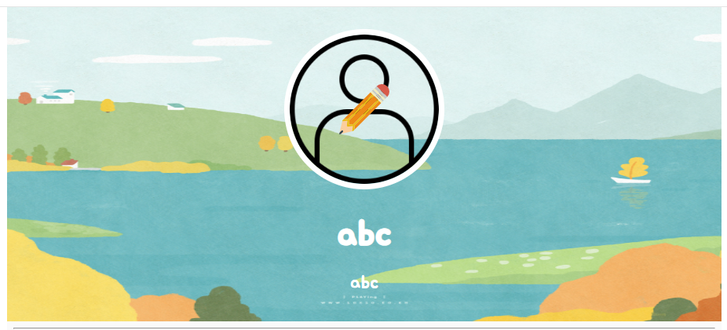
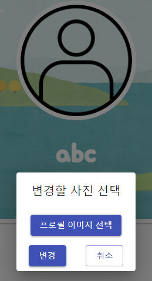
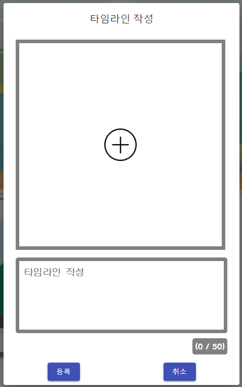
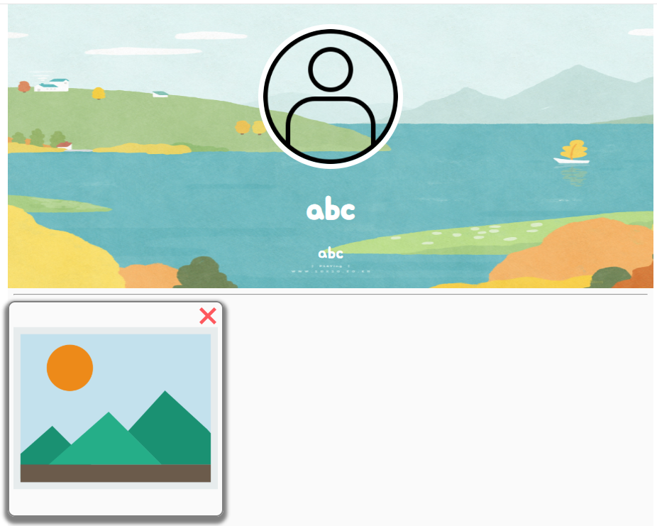
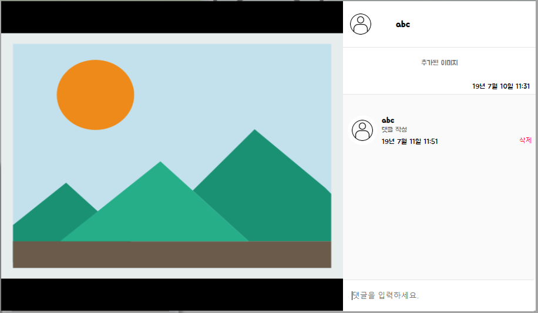
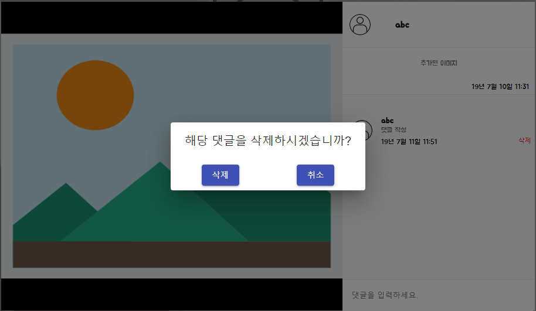

# 0. 프로젝트 개요
React, REST API, Redux, AWS RDS, AWS EC2의 기본 개념을 학습하고, 이를 바탕으로 제작한 개인 프로젝트입니다.

# 1. 프로젝트 설명
기본적으로 React를 활용하였습니다. 

REST API : 서버와의 POST 통신을 위하여 활용하였습니다. 
Redux : 로그인한 회원 정보 및 여러 action들을 관리하기 위하여 활용하였습니다. 
AWS RDS : 클라이언트에서 생성되는 데이터들을 저장하기 위해 활용하였습니다. 
AWS EC2 : 서비스를 항상 구동시켜놓기 위하여 활용하였습니다.

# 2. 기능 설명
## 2-1. 회원 관리
### 2-1-1. 회원 가입
 
간단하게 이메일 또는 아이디, 이름, 별명, 비밀번호만 입력받아 회원가입을 진행합니다.

### 2-1-2. 로그인
 
이메일 또는 아이디, 비밀번호를 입력받아 로그인이 진행됩니다.

### 2-1-3. 회원 탈퇴
 
 
네비게이션 바에서 회원 탈퇴 버튼을 클릭하면 
비밀번호를 확인합니다. 비밀번호가 일치한다면 회원탈퇴가 진행됩니다.

## 2-2. 게시물 관리
### 2-2-1. 개인 프로필 이미지 수정
 
개인 페이지에서 프로필 이미지 부분에 마우스를 올리게 되면 
 
이렇게 수정 버튼이 띄워집니다. 
 
그러면 프로필 이미지를 바꿀 수 있게 됩니다.

### 2-2-2. 타임라인 작성
 
해당 다이얼로그 창에서 이미지 및 글을 작성하여 타임라인을 작성할 수 있습니다.

### 2-2-3. 타임라인 삭제
 
타임라인의 X 버튼을 눌러 삭제를 진행할 수 있습니다.

### 2-2-4. 댓글 작성
 
타임라인을 열게 되면 위와 같은 화면이 출력됩니다.  
댓글을 입력할 수 있습니다.

### 2-2-5. 댓글 삭제
 
현재 로그인한 회원과 댓글을 작성한 계정이 같다고 판정되면 
삭제 버튼이 활성화되며, 삭제 버튼을 클릭하면 
 
위와 같은 화면을 통해 삭제를 진행할 수 있습니다.

# 3. 동작 확인
## 실제 동작은 다음 URL에서 확인 가능합니다.
### http://52.15.206.159:3000/
